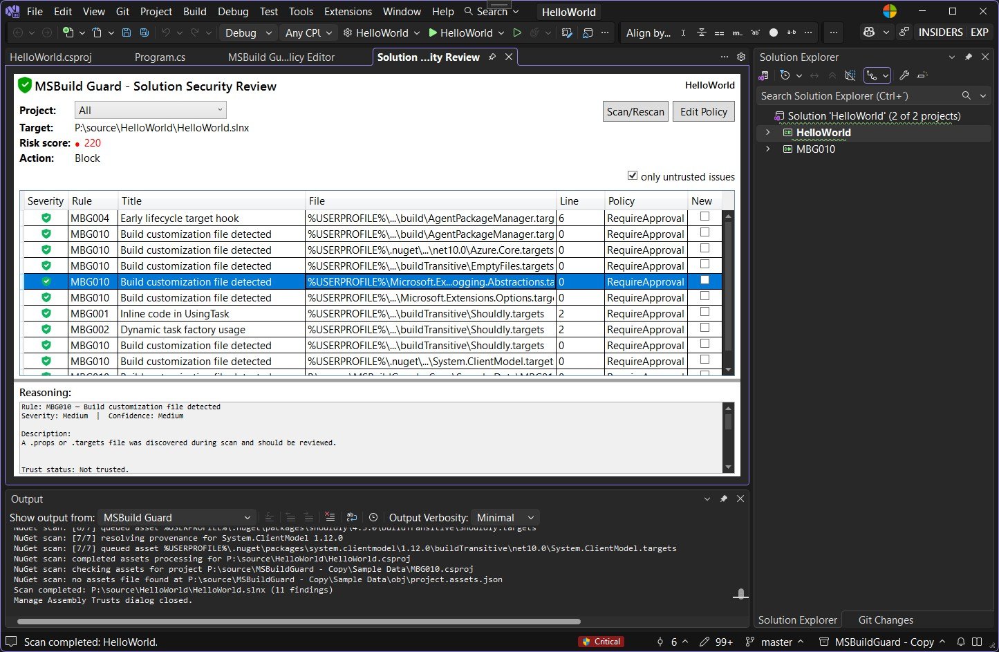
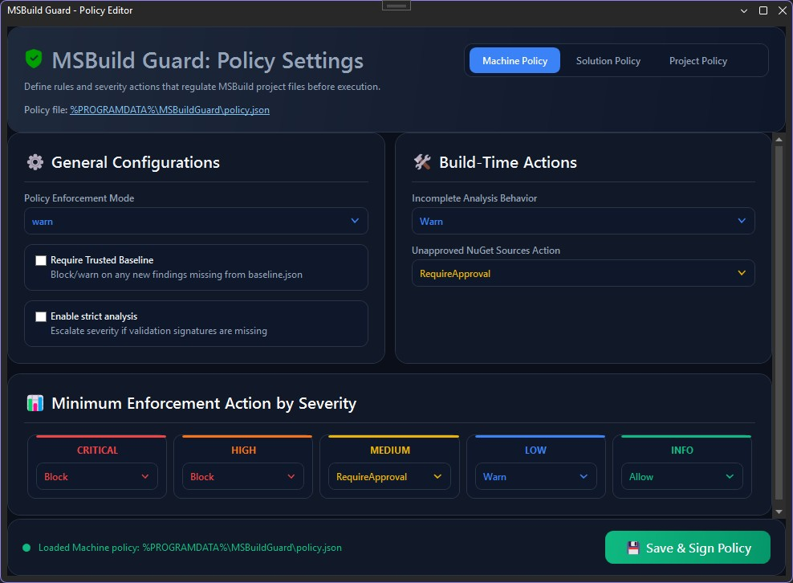
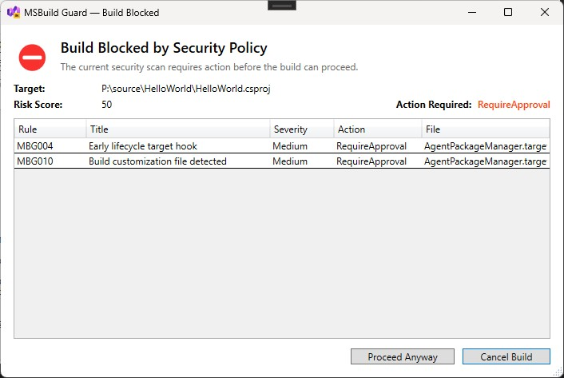
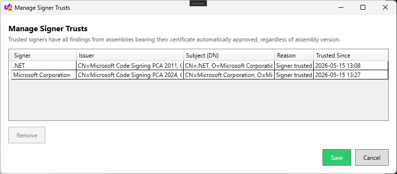
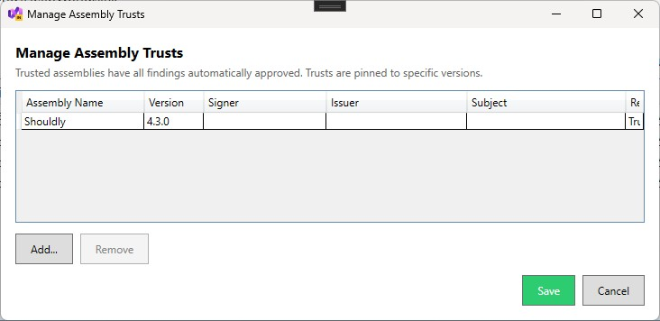

# MSBuild Guard Visual Studio Extension

MSBuild Guard for Visual Studio provides inline project risk visibility and trust workflows inside Visual Studio 2026.

## Target

- Visual Studio 2026 (Community, Professional, Enterprise), amd64
- Target framework: `.NET Framework 4.7.2`

## Main features

- Automatic scan on solution open
- Automatic scan after NuGet restore and package changes
- Status bar shield indicator (green / orange / red)
- **Project Security Review** and **Solution Security Review** tool windows
- Project filtering in Solution Security Review with scope-correct summaries
- Bottom **Reasoning** panel in review windows for selected finding context
- Double-click finding navigation to source file and location
- **Policy Editor** with machine, solution, and project scope selection
- Policy save triggers rescan and refreshes shield + open review windows
- Build enforcement with interactive blocker dialog (step/rule/risk context, Continue/Cancel)
- Security menu commands for review, policy editing, and baseline creation
- Output window progress logging for scan and NuGet package analysis activity

## Security review workflow

1. Scan solution through extension command or automatic triggers.
2. Open Project Security Review or Solution Security Review from the Security menu.
3. Review findings, target/risk/action summary, and reasoning details.
4. Double-click findings to navigate to source locations.
5. Edit policy as needed and save.
6. Extension rescans and refreshes shield/review state automatically.

## Baseline workflow in Visual Studio

- `Create Baseline...` command is enabled only when current recommended action is Allow (green state).
- If baseline already exists, overwrite confirmation is required.
- Baseline is persisted via shared Core baseline service.

## Integration model

The extension consumes shared Core scanner/policy/baseline/trust services. It is designed to avoid relying on project evaluation/build to decide whether MSBuild content is safe.

## How it works

1. The extension scans the open solution or project using the shared Core scanner.
2. The scanner evaluates MSBuild content, package assets, signatures, and policy rules.
3. Trust decisions are loaded from the local trust store and applied to findings.
4. Assembly trust and signer trust can automatically approve related findings.
5. The review window shows active findings, trusted findings, and the reasoning behind each decision.
6. The build blocker uses the same trust evaluation so build enforcement matches the review view.
7. When policy or trust changes are saved, the extension rescans and refreshes the status bar, review windows, and blocker state.

## UX surfaces

- Project Security menu commands
- Project Security Review tool window
- Status bar shield status
- Output window activity stream
- Assembly Information dialog
- Manage Assembly Trusts dialog
- Manage Signer Trusts dialog

## Tools → Options settings

The extension exposes a Visual Studio options page at:

- `Tools` → `Options` → `MSBuild Guard` → `General`

Current settings:

- **Auto-open Security Review** (`true` by default)
  - Automatically opens Project Security Review when a scan requires attention.
- **Scan NuGet packages** (`true` by default)
  - Enables NuGet restore monitor startup and package-asset-triggered rescans.
- **File types to scan** (semicolon-separated list)
  - Default: `.csproj;.vbproj;.fsproj;.proj;.props;.targets;.sln;.slnx`
- **Process creation indicators** (semicolon-separated list)
  - Default: `System.Diagnostics.Process;Process.Start(;CreateProcess(;cmd.exe;powershell;pwsh`
- **Reflection/interop indicators** (semicolon-separated list)
  - Default: `System.Reflection;Assembly.Load;Activator.CreateInstance;GetType(;dynamic ;DllImport;Marshal.GetDelegateForFunctionPointer;LoadLibrary`
- **Additional blocked assemblies** (semicolon-separated list)
  - Default: empty

## Notes

Visual Studio integration is best-effort pre-build protection in IDE workflows.

## Screenshots

The main review grid for the current solution, including severity, policy action, trusted status, and the reasoning panel for the selected finding.

The policy editor where machine, solution, and project scopes can be configured before saving and rescanning.

Shows the interactive build blocker that appears when policy requires attention, listing the findings that must be reviewed before the build can continue.

The signer trust management dialog, which lists trusted certificate subjects and lets you remove signer-level trust entries.

The assembly trust management dialog, which lists version-pinned assembly trust entries and lets you remove them.

