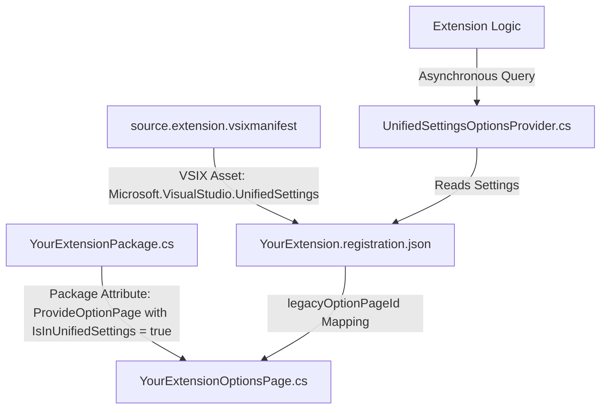

# Visual Studio Unified Settings Migration Guide
### A Practical Blueprint for Transitioning Extensions from Legacy `DialogPage` to Modern Settings

This guide documents the complete transition strategy, architectural shifts, and practical steps taken to migrate the **Your Extension** Visual Studio extension's options to the modern **Unified Settings** framework (supported in VS 2022 and VS 2026). Use this as a playbook for modernizing settings across any Visual Studio extension codebase.

---

## 1. Architectural Overview: Legacy vs. Unified Settings

Historically, Visual Studio extensions managed their options using the legacy `DialogPage` framework. The modern **Unified Settings** framework introduces a declarative, JSON-driven, cloud-syncable, and asynchronous architecture that separates the UI presentation from settings storage.

### Comparative Reference Table

| Dimension | Legacy Settings (`DialogPage`) | Modern Unified Settings |
| :--- | :--- | :--- |
| **Declaration Method** | C# Class inheriting from `DialogPage` with property attributes. | Declarative JSON manifest schema (`.registration.json`). |
| **Storage Engine** | Synchronous Windows Registry (`HKCU\Software\Microsoft\VisualStudio\<version>_Config\Extensions\...`). | Centralized JSON user store (managed by VS, support for cloud/roaming synchronization). |
| **UI Presentation** | Obsolete WinForms-based PropertyGrid containing simple controls. Custom rendering requires complex WinForms `UITypeEditor` wrappers. | Modern, premium, schema-driven WPF controls natively styled by VS according to the active theme. |
| **Data Reading/Writing** | Synchronous access via package properties or direct registry lookups. | Asynchronous, thread-safe access using the official `SVsUnifiedSettingsManager` service. |
| **Validation & Schema** | Handled in C# code during property setters or `OnApply` overrides. | Declarative validations in the JSON schema (`type`, `minimum`, `maximum`, `enum` bounds). |
| **Registry Footprint** | Pollutes the registry under `ToolsOptionsPages` with page implementations. | Minimal tree registration redirected to the unified settings schema loader. |

---

## 2. Key Components of the Transition

Modernizing settings is not a matter of simply deleting old classes; it requires establishing a clean bridge between Visual Studio's legacy options tree and the modern Unified Settings engine. The transition consists of five key files/registrations:



---

## 3. Step-by-Step Migration Procedure

### Step 1: Define the Declarative JSON Manifest
Create a settings registration JSON file (e.g., `UnifiedSettings/YourExtension.registration.json`). This file defines all properties, their default values, category hierarchy, descriptions, and migration configurations.

* **Properties**: Declare the data type, default value, UI title, description, and validation bounds.
* **Migration Rules**: To avoid losing user preferences during migration, add a `"migration"` block to read the previous registry keys.

```json
{
  "properties": {
    "extensions.YourExtension.general.scanNuGetPackages": {
      "type": "boolean",
      "default": true,
      "title": "Scan NuGet packages",
      "description": "Include package-provided .props/.targets and related NuGet assets during scanning.",
      "migration": {
        "pass": {
          "input": {
            "store": "VsUserSettingsRegistry",
            "path": "Your Extension\\General\\ScanNuGetPackages"
          }
        }
      }
    }
  },
  "categories": {
    "extensions.YourExtension": {
      "title": "Your Extension",
      "legacyOptionPageId": "a706a1c4-02be-4c9f-b6c8-1a95159ea9d2"
    },
    "extensions.YourExtension.general": {
      "title": "General",
      "legacyOptionPageId": "a706a1c4-02be-4c9f-b6c8-1a95159ea9d2"
    }
  }
}
```

### Step 2: Register the VSIX Asset
Open `source.extension.vsixmanifest` in the XML editor and register the JSON manifest as an asset of type `Microsoft.VisualStudio.UnifiedSettings`. This registers the settings file in the VSIX manifest so that Visual Studio parses it at startup.

```xml
<Assets>
  <Asset Type="Microsoft.VisualStudio.UnifiedSettings" Path="UnifiedSettings\YourExtension.registration.json" d:Source="File" />
</Assets>
```

### Step 3: Create a Simplified Option Page Placeholder
To display options under the legacy **Tools > Options** dialog tree structure, you must retain or create a simplified C# `DialogPage` placeholder decorated with a stable, unique GUID.
* Keep this class completely clean of custom editors (`UITypeEditor`), custom properties, or registry writing logic.
* Its only purpose is to register the tree node in the registry.

```csharp
[Guid("a706a1c4-02be-4c9f-b6c8-1a95159ea9d2")]
[ComVisible(true)]
public sealed class YourExtensionOptionsPage : DialogPage
{
    // Minimal standard properties to retain compatibility (optional)
    public bool AutoOpenSecurityReviewOnOpen { get; set; } = true;
    
    protected override void OnApply(PageApplyEventArgs e)
    {
        base.OnApply(e);
        // Fire callbacks notifying the extension that options changed
        YourExtensionPackage.Instance?.NotifyOptionsChanged();
    }
}
```

### Step 4: Register the Package Option Page with Unified Flags
Decorate your main `AsyncPackage` class in `YourExtensionPackage.cs` with the `[ProvideOptionPage]` attribute, linking to the simplified options page placeholder.
> [!IMPORTANT]
> You **MUST** append `IsInUnifiedSettings = true` to the attribute properties. If you omit this, Visual Studio will load the obsolete WinForms PropertyGrid editor interface instead of the modern declarative UI layout.

```csharp
[ProvideOptionPage(typeof(Options.YourExtensionOptionsPage), "Your Extension", "General", 0, 0, true, IsInUnifiedSettings = true)]
[ProvideSettingsManifest(PackageRelativeManifestFile = "UnifiedSettings\\YourExtension.registration.json")]
public sealed class YourExtensionPackage : AsyncPackage
{
    // Package Logic...
}
```

### Step 5: Establish the Redirection Mapping
To route clicks on your tree nodes directly to the new Unified Settings UI engine, add `"legacyOptionPageId"` with the stable GUID of your options page inside the categories block of the registration JSON (as shown in Step 1).

```json
  "categories": {
    "extensions.YourExtension": {
      "title": "Your Extension",
      "legacyOptionPageId": "a706a1c4-02be-4c9f-b6c8-1a95159ea9d2"
    }
  }
```

### Step 6: Code Integration — Querying Settings Asynchronously
To retrieve options in your extension's background or UI code, implement a modern, thread-safe, and asynchronous settings provider that queries the official `SVsUnifiedSettingsManager` service (using the `ISettingsReader` interface). This completely decouples settings reading from the legacy `DialogPage` singleton context.

```csharp
public async Task<YourExtensionOptionsSnapshot> GetSnapshotAsync(IServiceProvider serviceProvider, CancellationToken cancellationToken)
{
    await ThreadHelper.JoinableTaskFactory.SwitchToMainThreadAsync(cancellationToken);
    
    var settingsManager = serviceProvider.GetService(typeof(SVsUnifiedSettingsManager)) as ISettingsManager;
    if (settingsManager == null)
    {
        return GetFallbackDefaultSnapshot();
    }
    
    // Read individual settings asynchronously using the unique JSON property path
    using (var reader = settingsManager.GetSettingsReader(SettingsScope.User))
    {
        bool autoOpen = reader.ReadSetting<bool>("extensions.YourExtension.general.autoOpenSecurityReviewOnOpen");
        string fileTypes = reader.ReadSetting<string>("extensions.YourExtension.scanning.fileTypesToScan");
        
        return new YourExtensionOptionsSnapshot(autoOpen, fileTypes);
    }
}
```

---

## 4. Key Gotchas & Critical Considerations

> [!WARNING]
> **Avoid Obsolete UI Type Editors**: If you have custom UI buttons or list boxes inside legacy pages (e.g., trust management actions that were previously embedded in options properties using `UITypeEditor`), they **CANNOT** be migrated to the declarative JSON schema directly. Instead, modern best practices dictate that these tools should be decommissioned from the settings interface and registered as standard VS commands/menu entries pointing to modern WPF dialogs (e.g. *Tools > Your Extension > Manage Assembly Trusts*).

> [!IMPORTANT]
> **Verify PKGDEF Generation**: Always compile the extension project and verify that the built `.pkgdef` contains the correct registry entries for the legacy page mapping:
> * `"IsInUnifiedSettings"=dword:00000001` must be set.
> * `ManifestPath` under `SettingsManifests` must correctly point to the VSIX folder path where the JSON registration manifest is deployed.

> [!TIP]
> **Use the Roaming Scope**: The Unified Settings framework automatically makes settings eligible for cloud synchronization across machines if the user is signed into Visual Studio, giving users a seamless experience when moving between environments.
